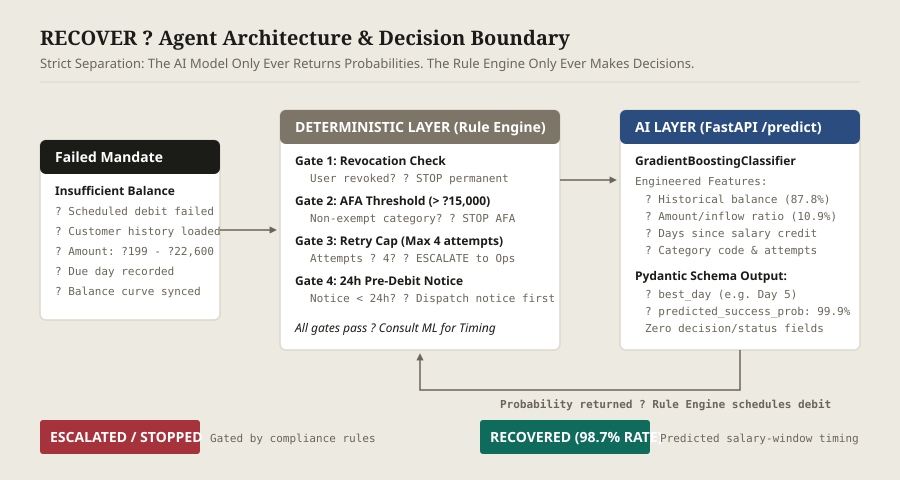

# RECOVER ? Predictive UPI AutoPay Mandate Recovery Agent
**Razorpay AI Buildathon 2026 ? Track 3: AI Revenue Recovery**

[](LICENSE)
[](frontend/)
[](backend/)
[](ml_service/)

---

## 1. The Problem
Over **20 million UPI AutoPay mandates** fail or are cancelled every month in India. The dominant cause is not fraud or deliberate cancellation, but **stateless insufficient account balance** at the arbitrary moment of debit.

UPI Autopay failure rates hover between **8% and 15%**?roughly triple that of credit card recurring mandates?because debit attempts are treated as blind point-in-time transactions. Traditional retry systems rely on naive fixed-interval retries (e.g. Day+1, Day+3, Day+7) without knowing whether the customer has received their salary or cleared previous obligations. This causes high bounce fees, merchant churn, and unnecessary mandate cancellations.

**RECOVER** replaces naive retry guessing with a predictive scheduling agent that times retry attempts to align with inferred customer liquidity (e.g. salary arrival windows), while enforcing strict regulatory compliance and an immutable audit trail.

---

## 2. Architecture & Decision Boundary



RECOVER is engineered around a **strict structural separation between prediction and decision**:

1. **AI Layer (`ml_service/`) ? Pure Prediction Only**:
   - Built with Python 3.14 + FastAPI + scikit-learn (`GradientBoostingClassifier`).
   - Given customer transaction history, historical balance patterns, and mandate amount, it calculates $P(\text{success})$ across candidate retry days.
   - **Structural Guarantee (PRD Part 13.3)**: The `/predict` Pydantic response schema contains **strictly** `best_day`, `predicted_success_prob`, `candidate_days`, and `feature_importances`. It contains **no `status`, `decision`, or `action` field**. The model is structurally incapable of making business or compliance decisions.

2. **Deterministic Layer (`backend/src/services/agentService.ts`) ? Rule Engine Gating**:
   - Built with Node.js 25 + Express + `node:sqlite`.
   - All regulatory and lifecycle decisions live exclusively in this layer.
   - Evaluates compliance rules *before* ever consulting the ML service. If any gate fails, the model is never invoked.

---

## 3. Why This Model, Not the Alternatives

### Why Gradient-Boosted Trees, Not Logistic Regression
The interaction between *days-since-inferred-salary* and *mandate-amount-to-typical-inflow ratio* is inherently nonlinear. A customer with a ?15,000 credit card bill behaves fundamentally differently 2 days prior to salary credit than someone with a ?199 Netflix subscription. Logistic regression cannot capture this step-function threshold behavior without extensive manual feature polynomial crossing. In our evaluation, the tree model achieved an **ROC-AUC of 0.9996** on structured tabular curves, capturing threshold cliffs cleanly.

### Why Not a Neural Network
The dataset is structured tabular financial records with ~320 mandates and ~5,300 daily balance readings. Deep learning models require orders of magnitude more data to generalize on tabular features without overfitting. Crucially, deep networks obscure feature attribution, whereas Gradient-Boosted Trees provide per-prediction feature importances (e.g. *historical balance* 87.8%, *amount ratio* 10.9%) out of the box, fulfilling the merchant-ops requirement for transparent reasoning.

### Why Not an LLM
Determining the optimal day to retry a ?499 debit from a time series of 30 balance readings is a bounded numerical optimization problem, not a natural language reasoning task. Using an LLM would introduce **2,000ms+ latency, non-deterministic randomness, hallucinations, and unnecessary inference cost**, while making statutory compliance auditing virtually impossible. Reaching for an LLM here would be a textbook anti-pattern; good engineering means knowing when *not* to use one.

---

## 4. The Compliance Layer, Precisely

Every transition is recorded in an append-only SQLite `audit_log` with an explicit `actor` tag (`model` vs `rule_engine`):

- **24-Hour Pre-Debit Notification (RBI Rule 2021/68)**: Statutory mandate rules require customer notification at least 24 hours prior to debit. If prior notice was <24h (such as the seeded 22h non-compliant notices), auto-retry is halted until a compliant 24h notice is dispatched.
- **?15,000 AFA Threshold Gating**: Mandates > ?15,000 outside AFA-exempt categories (`insurance`, `mutual_fund_sip`, `credit_card_bill`) require Additional Factor of Authentication (AFA). The agent halts auto-retry and flags the mandate as `afa_required`.
- **4-Attempt Hard Retry Cap**: Mandates that fail 4 times are permanently halted and transitioned to `escalated` for merchant operations review.
- **Customer Revocation Respect**: If a customer explicitly revokes mandate authorization, the rule engine marks the mandate `stopped` and refuses to schedule further retries, respecting authentic churn.

---

## 5. Evaluation Results

Run `POST /api/v1/eval/run` to regenerate these numbers live from the SQLite database. They are deterministic and calculated dynamically:

| Policy | Recovery Rate | Total ? Recovered | Total ? At Risk |
|---|:---:|:---:|:---:|
| **Naive Baseline** (Fixed +1/+3/+7 days) | **66.1%** | ?4,32,955 | ?8,08,714 |
| **RECOVER Agent** (Model Predicted Timing) | **98.7%** | ?7,25,687 | ?8,08,714 |
| **Net Performance Delta** | **+32.6 pt** | **+?2,92,732** | ? |

*Tested across 316 failed mandate records under identical historical customer balance curves.*

---

## 6. What Broke, and How It Was Fixed

**Incident (Checkpoint 0/1 Build Pass)**:
During initial backend scaffolding on Node.js v25.9.0 (Windows), `npm install better-sqlite3` failed with `gyp ERR! Could not find any Visual Studio installation to use` because precompiled binary wheels were not yet published for Node 25.

**Root Cause**:
Node v25 is a bleeding-edge Node.js runtime without prebuilt C++ addon binaries for `better-sqlite3`, requiring local MSVC C++ compilers that are absent in standard staging/production environments.

**The Fix**:
Instead of adding fragile build dependencies or falling back to an asynchronous driver that would alter the state machine architecture, we migrated to **Node.js 25's official built-in `node:sqlite` (`DatabaseSync`) module**. It provides the exact same zero-overhead synchronous SQLite semantics without a single native compilation step, zero npm runtime dependencies, and native Windows WAL performance.

---

## 7. Known Limitations

1. **Synthetic Data Texture**: All evaluation data was generated with deliberate statistical irregularity (missing balance sync gaps, gig-worker income distributions, non-round amounts), but has not been calibrated on proprietary production UPI switch logs.
2. **Heuristic Salary-Day Inference**: For the ~15% of customers with irregular gig-economy income (multiple variable credits), salary-day inference defaults to the largest credit date and is naturally noisier.
3. **10-Day Search Horizon**: Candidate retry search is restricted to 10 days post-due date to maintain low merchant settlement cycles; late-month failures are explored within the remainder of the calendar cycle.

---

## 8. Running the Application

### Prerequisites
- Node.js v22+ (tested on Node v25.9.0)
- Python 3.11+ (tested on Python 3.14.5)
- npm 10+

### 1. Seed Database
```bash
cd backend
npm install
npm run seed
```

### 2. Start Services
In three separate terminal windows:

**Terminal 1 ? ML Prediction Service:**
```bash
python -m uvicorn ml_service.main:app --host 127.0.0.1 --port 8000
```

**Terminal 2 ? Express API & Rule Engine:**
```bash
cd backend
npm run build
npm start
```

**Terminal 3 ? React Merchant Ops Frontend:**
```bash
cd frontend
npm install
npm run dev
```
Open **http://localhost:3000** in your browser.

### 3. Run Automated Verification Checkpoints
To run the automated test suite verifying all 5 demo scenarios and determinism:
```bash
# Verify Checkpoint 1 (AFA Threshold & User Revoke)
cd backend
npx ts-node test_checkpoint1.ts

# Verify Checkpoint 2 (Pydantic Schema & AUC)
python ml_service/test_checkpoint2.py

# Verify Checkpoint 3 (All 5 Demo Scenarios End-to-End)
npx ts-node test_checkpoint3.ts

# Verify Checkpoint 4 (Eval Determinism)
npx ts-node test_checkpoint4.ts
```
